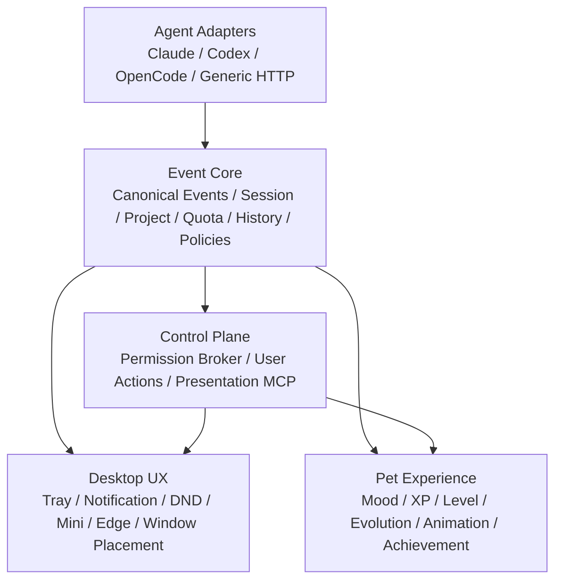
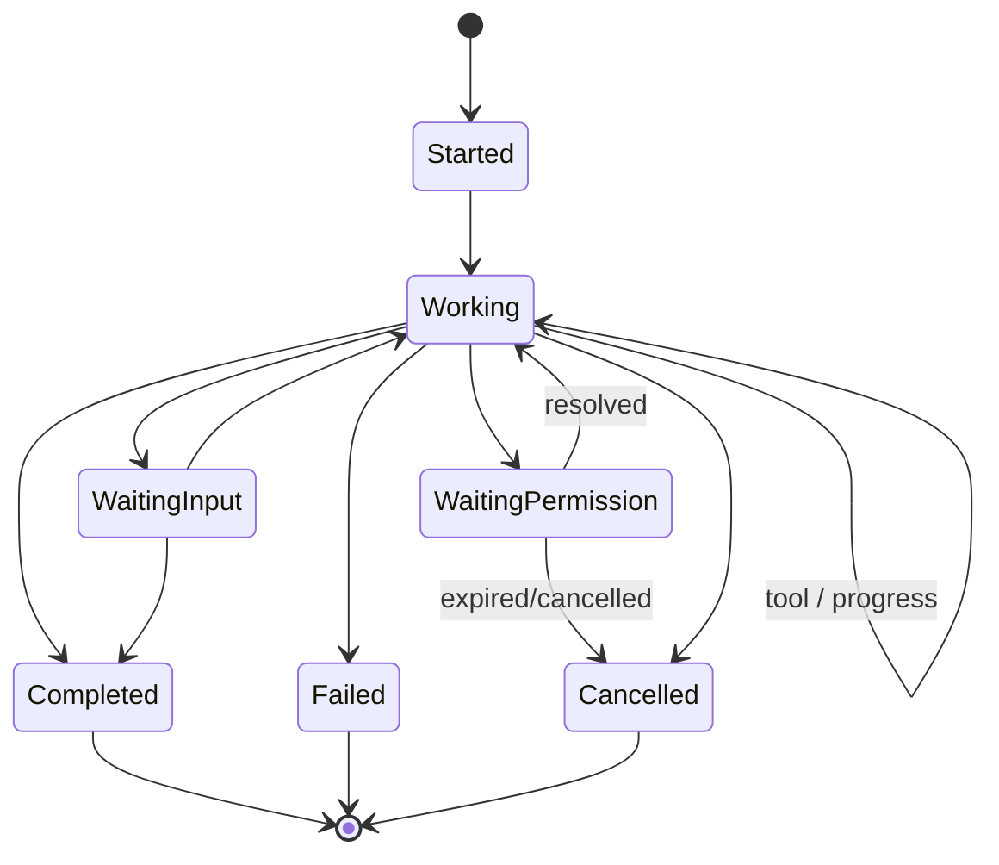
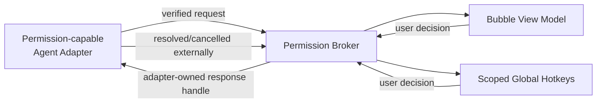
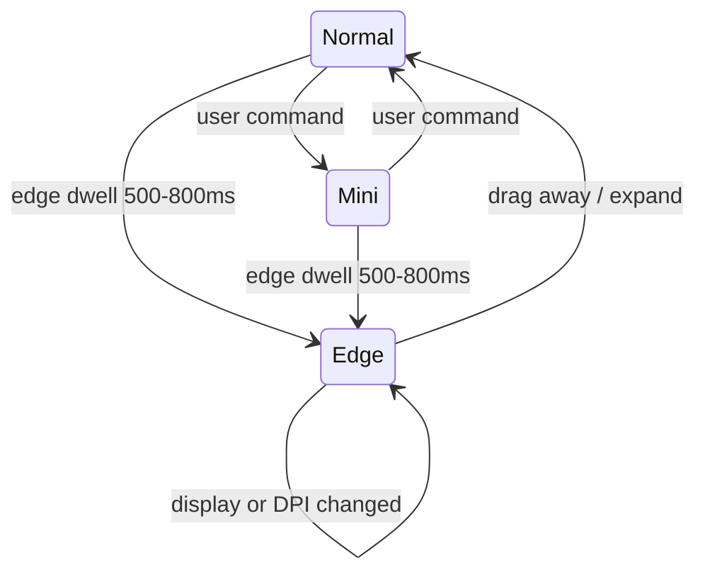
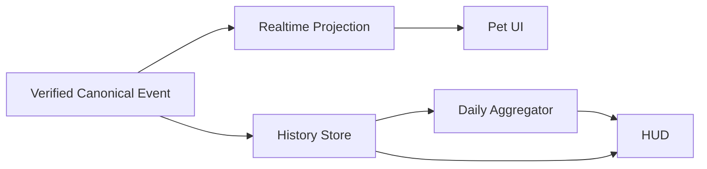

# Desktop Pet Architecture v2 + Feature Roadmap

> 文件狀態：可實作基準（Implementation Baseline）
> 語言：繁體中文
> 適用產品：Agent Pets 桌面應用程式
> 架構目標：在不一次重寫既有系統的前提下，將現有桌寵從「Agent 狀態看板」演進為安全、可擴充、可長期常駐的「本機 Agent 伴侶」
> Roadmap 順序：Tray → Permission → XP → Mini → Adapter SDK → MCP → History/HUD → Project Pet → Achievements → Shimeji

---

## 0. 文件目的與決策摘要

本文件是 Architecture v2 的產品、架構與交付規格。Claude、Codex 或人類開發者應以此文件作為實作邊界；若現有程式碼與本文命名不同，可以調整檔名與類別名，但不得默默改變安全模型、資料所有權或層級依賴方向。

目前專案已具備：

- mood 與長任務進度回饋；
- 多寵物；
- quota 資料；
- OpenCode、Codex、Claude Code hooks；
- 自訂 sprite；
- 本機 `POST /v1/events` 事件入口；
- Electron main process；
- 透明視窗與 click-through，包含 DOM hit target、canvas alpha hit testing 與 Electron mouse passthrough；
- 事件中的 session、agent/source、project 等可用線索。

Architecture v2 的核心決策如下：

1. **既有 hooks 仍是事實來源。** MCP 不取代 hooks。
2. **Permission 是獨立 Control Plane。** 不可當成普通 event handler，也不可接受任意 callback URL。
3. **Event Core 先正規化，再驅動 UI、歷史、XP 與通知。** 任何功能不得各自解析原始 hook payload。
4. **mood 是短期狀態，XP 是長期成長。** 兩者分開計算、分開持久化。
5. **不同 Agent 的能力不假設相同。** UI 與流程必須依 capability negotiation 降級。
6. **先補齊桌面常駐體驗，再擴大遊戲化。** Tray/通知/DND 優先於 XP。
7. **採 strangler migration。** 以相容層包住既有 `/v1/events` 與 store，逐步抽離，而非一次重寫 `electron/main.ts`。
8. **本機優先、無帳號。** 使用者活動資料預設只留在本機。
9. **視覺採 Liquid Glass 原則。** 玻璃材質只用於浮動控制、導航與暫態互動層；內容層保持清楚，避免 glass-on-glass，並提供降低透明度、高對比與降低動態效果的 fallback。
10. **版本更新是驗收後動作。** 每個 Phase 完成功能與安全檢測後先交付報告，只有使用者明確確認才更新版本；預設 patch，大型架構、持久化 schema、公開契約或安全邊界變更使用 minor。

---

## 1. 產品定位與範圍

### 1.1 產品定位

Agent Pets 是一個本機優先的桌面 Agent 伴侶，將 coding agent 的工作狀態、等待狀態、完成結果、配額與長期使用歷程，以桌寵、通知、HUD 和輕量互動呈現。

產品價值分成三層：

- **可見性：** 不必一直切回終端機，也能知道 Agent 正在思考、執行、等待、成功或失敗。
- **可操作性：** 對明確支援安全回應能力的 Agent，可在桌面寵物上處理一次性 permission request。
- **陪伴與留存：** mood 表示今天的狀態，XP、等級、進化、成就與 project pet 表示長期關係。

### 1.2 目標使用者

- 同時使用 Codex、Claude Code、OpenCode 或其他 coding agent 的開發者；
- 長時間把 Agent 放在背景執行，需要低干擾狀態回饋的使用者；
- 喜歡桌面角色、養成與本機資料所有權的使用者。

### 1.3 產品範圍

v2 包含：

- 桌面常駐基礎：Tray、原生通知、DND、啟動與顯示控制；
- 安全的一次性 Permission Broker；
- XP、Level、Evolution 與持久化；
- Mini/Edge mode 與多螢幕正確定位；
- 可擴充 Agent Adapter SDK 與 capability matrix；
- 僅用於 presentation 的本機 MCP server；
- 本機 history、HUD、project binding、achievements；
- 第一版 Shimeji 自主行為引擎。

### 1.4 成功指標

第一輪不以雲端成長或社群指標為目標，使用本機可量測指標：

- 每日啟動後持續常駐時間；
- DND、Mini/Edge mode 的使用比例；
- 通知點擊率與冷卻後的通知數量；
- permission request 的正確呈現率、逾時率、重播阻擋率；
- 事件正規化失敗率、adapter 安裝成功率；
- 7/30 日使用 streak（僅本機）；
- crash-free session 與資料庫 migration 成功率。

---

## 2. 五層架構



### 2.1 Pet Experience

負責「寵物如何感受與表現」：

- mood 與短期狀態；
- XP ledger、Level、Evolution；
- animation intent 與 sprite mapping；
- achievements 與解鎖呈現；
- Shimeji behavior intent。

不負責：解析 agent 原始 payload、送出 permission decision、控制 Electron 原生 API、直接寫 SQLite。

### 2.2 Desktop UX

負責「桌面應用程式如何常駐與互動」：

- Tray/menu、Notification、DND；
- window show/hide、click-through、always-on-top；
- Normal/Mini/Edge mode；
- 多螢幕、DPI、work area 與位置回復；
- 全域快捷鍵的生命週期註冊，但不決定 permission 結果。

不負責：自行判斷事件可信度、XP 規則、Adapter 安裝細節。

### 2.3 Control Plane

負責「使用者或 Agent 主動要求系統做什麼」：

- Permission Broker；
- 使用者對 request 的 allow-once/deny；
- agent 經 MCP 發出的 `pet_say`、`pet_react`；
- rate limit、TTL、權限與輸入驗證；
- 將安全決策交回擁有該 request 的 Adapter。

Control Plane 是安全邊界。Presentation MCP 與 Permission Broker 雖同層，但必須是不同模組、不同 capability 與不同 IPC channel。

### 2.4 Event Core

負責全系統唯一的 canonical truth：

- 接收 Adapter 的正規化事件；
- schema validation、版本轉換、去重、排序與 session correlation；
- 即時 projection（目前狀態）；
- 歷史寫入、每日聚合、quota snapshot；
- 對 XP、通知、成就等 policy engine 發佈已驗證事件。

不負責：直接 render、直接呼叫 Electron Tray、直接執行 Agent callback。

### 2.5 Agent Adapters

負責「各 Agent 世界與 canonical model 的翻譯」：

- detect/install/uninstall/diagnose；
- 原始 hook、CLI 或 wrapper payload 解析；
- 產生 canonical event；
- 宣告實際 capability；
- 若 Agent 有原生 permission response channel，封裝 request/response correlation。

不負責：XP、通知、bubble UI、成就或資料庫聚合。

### 2.6 依賴規則

- 上層可以訂閱下層公開契約，不可 import 下層內部實作。
- Agent Adapter 不可 import renderer store。
- Renderer 不可直接連 SQLite、HTTP listener 或 Agent CLI。
- Electron main process 的原生 API 經小型 service/manager 與 typed IPC 暴露。
- 所有跨 process 資料都要 schema validation；TypeScript type 本身不是 runtime 驗證。
- 原始 payload 只可存在 Adapter 邊界與受控診斷紀錄，不可流入各功能模組。

---

## 3. 建議模組、職責與邊界

實際路徑可以配合現有專案調整，建議邏輯結構如下：

| 模組 | Process | 職責 | 對外契約 |
|---|---|---|---|
| `adapters/*` | Main/Node | 偵測、安裝、解析、capability、permission response | `AgentAdapter` |
| `event-core/ingress` | Main | 接收 `/v1/events` 與 adapter event | `ingest(event)` |
| `event-core/normalizer` | Main | schema version、canonical mapping | `normalize(raw)` |
| `event-core/bus` | Main | 發佈 verified events | typed subscription |
| `event-core/projections` | Main | session/pet/quota current state | readonly snapshots |
| `persistence` | Main | SQLite、migration、transaction、retention | repositories/UoW |
| `permission-broker` | Main | request state machine、TTL、anti-replay、response dispatch | broker API |
| `desktop/tray` | Main | Tray/menu state | commands + view model |
| `desktop/notifications` | Main | DND、cooldown、原生通知 | notification policy |
| `desktop/window-manager` | Main | position、display、mode、click-through | window commands |
| `progression` | Main/domain | XP ledger、level、evolution | pure policy + repo |
| `achievements` | Main/domain | achievement evaluator | pure rules + repo |
| `presentation-mcp` | Main/child | status/react/say | three bounded tools |
| `renderer/stores` | Renderer | 顯示用 projection | typed IPC snapshots |
| `renderer/components` | Renderer | Pet、HUD、bubble、settings | UI events only |
| `behavior-engine` | Renderer/domain | Shimeji intent scheduler | behavior intent |

### 3.1 IPC 邊界

建議將 IPC 分成三類：

- `query:*`：只讀 snapshot，例如 `query:pet-state`、`query:history-summary`；
- `command:*`：使用者命令，例如 `command:set-dnd`、`command:set-window-mode`；
- `event:*`：main 主動推播，例如 `event:canonical`、`event:permission-updated`。

禁止 renderer 傳入任意 method name、URL、shell command、檔案路徑或 SQL。Preload 只暴露列舉過的 typed API，保持 `contextIsolation: true`，不開放 `nodeIntegration`。

---

## 4. Event Model

### 4.1 Canonical Event Envelope

```ts
type EventTrust = "adapter_verified" | "local_user" | "presentation_untrusted";

interface CanonicalEvent<TType extends EventType, TPayload> {
  schemaVersion: 2;
  eventId: string;              // App 產生的 UUID；全域唯一
  sourceEventId?: string;       // Adapter 可取得時保留；用於 idempotency
  type: TType;
  occurredAt: string;           // Agent 宣告時間，ISO 8601 UTC
  receivedAt: string;           // App 收到時間，ISO 8601 UTC
  sequence?: number;            // 同一 session 內由 adapter 提供
  trust: EventTrust;

  agent: {
    adapterId: string;
    agentId: string;
    displayName: string;
    version?: string;
  };

  session?: {
    sessionId: string;
    correlationId?: string;
  };

  project?: {
    projectId: string;          // 本機 canonical id
    displayName?: string;
    pathFingerprint?: string;   // 不在一般 UI/API 暴露原始絕對路徑
  };

  payload: TPayload;
  diagnostics?: {
    normalizedFrom?: string;
    warnings?: string[];
  };
}
```

### 4.2 Event taxonomy

| 類別 | Event type | 用途 |
|---|---|---|
| Lifecycle | `agent.session.started` | 建立 session projection |
| Lifecycle | `agent.working` | 思考或持續工作 |
| Lifecycle | `agent.tool.started` | 工具開始；不直接給 XP |
| Lifecycle | `agent.tool.completed` | 工具完成；供 mood/活動統計 |
| Waiting | `agent.waiting_input` | 需要一般輸入 |
| Permission | `agent.permission.requested` | 僅由具 permission capability 的 Adapter 產生 |
| Permission | `agent.permission.resolved` | Agent 端或 Broker 完成決策 |
| Terminal | `agent.session.completed` | 成功完成 |
| Terminal | `agent.session.failed` | 失敗 |
| Terminal | `agent.session.cancelled` | 使用者或 Agent 取消 |
| Quota | `agent.quota.snapshot` | 即時 quota/usage snapshot |
| Presentation | `pet.presentation.requested` | MCP say/react；不影響 XP/history truth |
| System | `adapter.health.changed` | Adapter 安裝/健康狀態 |

### 4.3 Lifecycle state machine



不合法的倒序事件不得直接回捲 projection。Event Core 可保留歷史事件並加 warning，但 terminal session 除非收到明確的新 generation/session id，不可回到 working。

### 4.4 去重、排序與時鐘

- 首選 dedupe key：`adapterId + sourceEventId`。
- 無 source id 時使用有限時間窗 fingerprint：`type + sessionId + normalized payload hash + occurredAt bucket`。
- XP、Achievement、通知都必須以 event idempotency key 寫 ledger，不能只靠記憶體 flag。
- `occurredAt` 可用於顯示；安全 TTL 與到期判斷使用 main process 的單調時鐘/`receivedAt`，避免 Agent 偽造時間。
- 每個 Adapter 應提供 session 內 sequence；缺少 sequence 時採 arrival order，但要標記較低 ordering confidence。

### 4.5 原始 payload 保留

預設不永久保存完整 raw payload。若開啟診斷模式：

- 僅保存 allowlist 欄位與錯誤摘要；
- 移除 prompt、tool arguments、環境變數、token、完整路徑與 callback 資訊；
- 設定短期 retention（建議 7 日）；
- UI 明確顯示「診斷紀錄可能包含專案中繼資料」。

---

## 5. Capability Model

### 5.1 原則

「有安裝」不等於「所有能力都可用」。能力必須由 Adapter 在 runtime 宣告，UI 不得以 agent 名稱硬編碼假設。

```ts
type CapabilitySupport = "none" | "observe" | "respond";

interface AgentCapabilities {
  lifecycle: boolean;
  sessions: boolean;
  projects: boolean;
  toolActivity: boolean;
  tokenUsage: "none" | "estimated" | "exact";
  quota: "none" | "local" | "provider";
  waitingInput: boolean;
  permissions: CapabilitySupport;
  permissionModes: Array<"allow_once" | "deny">;
  orderedEvents: boolean;
  healthCheck: boolean;
}
```

### 5.2 Capability Matrix（v2 起始基準）

下表是產品行為基準，不是對所有版本的永久承諾。Adapter 的 `detect()`/`diagnose()` 結果是 runtime 真相。

| Adapter | Lifecycle | Session | Project | Tool activity | Token/Quota | Permission observe | Permission respond | 安裝方式 |
|---|---:|---:|---:|---:|---|---:|---:|---|
| Claude Code | ✓ | ✓ | ✓ | ✓ | 依 hook payload | 依版本探測 | 依版本探測 | hook installer |
| Codex | ✓ | ✓ | ✓ | ✓ | 依 hook/quota source | ✓ waiting 狀態 | 預設不宣告；完成安全通道後才開 | `hooks.json` + wrapper |
| OpenCode | ✓ | ✓ | ✓ | ✓ | 依 plugin/event | 依版本探測 | 依版本探測 | plugin/hook installer |
| Generic HTTP | ✓ | 選配 | 選配 | 選配 | 選配 | 不允許 | 不允許 | 本機 `/v1/events` token |

降級規則：

- `permissions=observe`：可顯示「請回終端機處理」，不可顯示 Allow 熱鍵。
- `permissions=none`：普通 waiting UI，不建立 Permission Broker request。
- `tokenUsage=estimated`：HUD 必須標示估算，不可與 exact 混為一談。
- 無 project：路由到 default pet，不阻擋 lifecycle 顯示。
- 無 ordered events：投影採保守轉移並顯示診斷狀態。

---

## 6. Permission Broker 安全設計

### 6.1 安全目標

Permission Broker 讓使用者在桌面上對「已由特定 Adapter 建立、可被可靠對應、尚未過期」的單一 request 做一次性決策。它不是一般遠端控制 API，也不是自動批准器。

### 6.2 架構



### 6.3 強制安全規則

1. `/v1/events` 不得接受或執行任意 callback URL、command、port、pipe path。
2. localhost 不是信任邊界。Generic HTTP events 永遠不能取得 `permission.respond` capability。
3. Response channel 由已安裝 Adapter 在建立 request 時以不透明 handle 綁定，只有該 Adapter 能解析。
4. request 綁定 `requestId + adapterId + agentId + sessionId + generation`。
5. request 有短 TTL（建議 60 秒，可由 adapter 在 15–300 秒範圍內縮短，不可無限延長）。
6. request 是 one-shot。任何 terminal decision 後立即不可重用。
7. Broker 在 transaction 中以 compare-and-set 將 `pending → deciding → resolved`；並行按鍵只能有一個勝出。
8. 全域快捷鍵只在至少一個可回應 request 顯示時註冊，bubble 消失立即解除，避免搶走終端機快捷鍵。
9. 預設 decision 僅 `allow_once` 或 `deny`。v2 不提供 persistent auto-allow。
10. action、description、project 只作顯示，不得包含可點擊 URL 或可執行 markup；全部以純文字 escape。
11. 視窗失焦、鎖屏、休眠恢復或 adapter disconnect 時，pending request 預設過期，不自動批准。
12. Agent 若已在終端機完成決策，Adapter 必須送 resolved/cancelled，Broker 立即撤下 bubble 與 hotkey。
13. 每筆 decision 寫入最小 audit record；不保存 prompt/tool secret。

### 6.4 資料模型

```ts
type PermissionRequestStatus =
  | "pending"
  | "deciding"
  | "allowed"
  | "denied"
  | "expired"
  | "cancelled"
  | "delivery_failed";

interface PermissionRequest {
  requestId: string;
  adapterId: string;
  agentId: string;
  sessionId: string;
  projectId?: string;
  generation: number;

  action: string;               // 短標題，例如「執行 shell command」
  description: string;          // 純文字、長度限制
  risk?: "low" | "medium" | "high" | "unknown";

  createdAt: string;
  receivedAt: string;
  expiresAt: string;
  status: PermissionRequestStatus;
  responseHandle: string;       // Broker 不解讀；資料庫加密或不落盤
  allowedDecisions: Array<"allow_once" | "deny">;
}

interface PermissionDecision {
  decisionId: string;
  requestId: string;
  decision: "allow_once" | "deny";
  decidedAt: string;
  decidedBy: "bubble" | "hotkey";
  brokerNonce: string;
}
```

SQLite 最小欄位：

```sql
permission_requests(
  request_id TEXT PRIMARY KEY,
  adapter_id TEXT NOT NULL,
  agent_id TEXT NOT NULL,
  session_id TEXT NOT NULL,
  project_id TEXT,
  generation INTEGER NOT NULL,
  action TEXT NOT NULL,
  description TEXT NOT NULL,
  risk TEXT NOT NULL,
  received_at INTEGER NOT NULL,
  expires_at INTEGER NOT NULL,
  status TEXT NOT NULL,
  response_handle_ref TEXT,
  resolved_at INTEGER,
  terminal_reason TEXT
)
```

`response_handle_ref` 優先指向記憶體中的 adapter-owned handle；若 app restart 後無法安全恢復，request 一律標記 `expired`，不要嘗試重播。

### 6.5 Queue 與 UI

- 同時多筆 request 以 received order 堆疊，明確顯示「1/3」。
- 熱鍵只作用在目前聚焦的最上層 request。
- Allow 使用 `Ctrl+Shift+Y`、Deny 使用 `Ctrl+Shift+N` 時，需允許設定停用或改鍵。
- 高風險或描述被截斷的 request，第一版可要求 bubble click 再確認，不允許單鍵批准。
- DND 不應完全隱藏 permission；DND 下顯示安靜 bubble/Tray badge，但不播放聲音或一般通知。

### 6.6 威脅與控制

| 威脅 | 控制 |
|---|---|
| 本機惡意程式 POST 假 request | Generic ingress 無 respond capability；per-adapter token；schema allowlist |
| 重播舊 request | requestId/generation/TTL/terminal CAS/nonce |
| callback SSRF 或命令執行 | 完全禁止 payload callback URL；只用 adapter-owned handle |
| 熱鍵誤觸 | 只在 bubble 期間註冊；高風險二次確認；可停用 |
| 終端機先決定但 bubble 仍在 | Adapter resolution reconciliation |
| app restart 後重送 allow | 所有未完成 request 失效，不恢復 response handle |
| renderer 被注入 | context isolation、typed preload、main 再驗證、純文字 render |

---

## 7. Agent Adapter Interface

```ts
interface AdapterContext {
  emit(event: CanonicalEvent<EventType, unknown>): Promise<void>;
  logger: RedactingLogger;
  secrets: AdapterSecretStore;
  paths: AdapterInstallPaths;
}

interface AdapterDetection {
  installed: boolean;
  version?: string;
  health: "ready" | "needs_install" | "needs_approval" | "degraded" | "error";
  message?: string;
  capabilities: AgentCapabilities;
}

interface AgentAdapter {
  readonly id: string;
  readonly displayName: string;
  readonly adapterVersion: string;

  detect(ctx: AdapterContext): Promise<AdapterDetection>;
  install(ctx: AdapterContext): Promise<AdapterDetection>;
  uninstall(ctx: AdapterContext): Promise<void>;
  diagnose(ctx: AdapterContext): Promise<DiagnosticReport>;

  normalize(input: AdapterRawEvent, ctx: AdapterContext):
    Promise<CanonicalEvent<EventType, unknown>[]>;

  respondToPermission?(
    handle: PermissionResponseHandle,
    decision: PermissionDecision,
    ctx: AdapterContext
  ): Promise<"delivered" | "already_resolved" | "rejected">;
}
```

### 7.1 Adapter 安裝原則

- install 必須 idempotent；重跑不應重複插入 hook。
- 修改使用者設定前顯示差異與復原資訊。
- uninstall 只移除本產品擁有的區塊，不覆寫其他 hook。
- Windows packaged Electron 不可把 `process.execPath` 當 Node interpreter；必須解析真實 `node.exe`，並能修復舊 hook。
- 安裝成功不能只看檔案存在；要做最小 live event round-trip，並分別驗證 receiver mapping 與 UI projection。
- 每個 Adapter 都提供 fixture-based contract test，以及至少一個平台實際整合測試。

### 7.2 Generic HTTP Adapter

- 僅 bind `127.0.0.1`/`::1`，不監聽 LAN；
- 使用安裝時產生的本機 bearer token 或等效秘密；
- payload size、rate、字段、字串長度皆設限；
- 不支援 permission respond、任意檔案、command、callback；
- 保留 v1 endpoint 相容層，但轉換後才進 Event Core。

---

## 8. XP / Level / Evolution

### 8.1 設計目標

- mood：日內、短期、可因長任務與結果變動；可每日重置。
- XP：跨日、長期、只能透過 ledger 追加或管理動作修正。
- token 只作小額活動 bonus，避免形成「浪費 token 升級更快」的錯誤誘因。
- 同一事件不得重複給 XP；presentation MCP 不給 XP。

### 8.2 XP 規則 v1

| 條件 | XP | 限制 |
|---|---:|---|
| `agent.session.completed` | +20 | 每個 canonical session 一次 |
| first completion of day | +10 | 每個 pet/本地日一天一次 |
| 有效 active coding 30 分鐘 | +2 | 每 session 最多 +10；排除 idle/waiting |
| daily streak 延續 | +5 | 每天一次；不因時區切換重複給 |
| 累計 100k token milestone | +1 | 每日最多 +5；estimated 來源可不給或標低權重 |
| 明確取消或失敗 | +0 | 不扣永久 XP |

不要對每個 tool call 直接發 XP。工具事件可能被重送、粒度不一致，也會鼓勵拆碎工作；它們可以繼續影響 mood 與 activity duration。

### 8.3 等級曲線

每級所需 XP：

```ts
xpToNext(level: number) = 100 + 25 * (level - 1);
```

累計門檻：

```ts
totalXpForLevel(level: number) =
  ((level - 1) * (200 + 25 * (level - 2))) / 2;
```

所有計算使用 integer。Level 由 total XP 推導，不在多處各自增減。

### 8.4 Evolution

| 階段 | 解鎖 Level | 第一版視覺策略 |
|---|---:|---|
| Egg | 1 | 基礎 sprite / nameplate |
| Baby | 5 | 小配件或 aura |
| Teen | 10 | 新 idle variation |
| Adult | 20 | 進階配件/色彩效果 |
| Master | 35 | 特殊 aura、speech/idle 組合 |

第一版不要求每階段一整套新角色美術。Evolution 應以 accessory、aura、idle variation 與 speech style 解鎖為主，避免美術阻塞核心資料模型。

### 8.5 持久化 schema

```sql
pets(
  pet_id TEXT PRIMARY KEY,
  name TEXT NOT NULL,
  sprite_id TEXT NOT NULL,
  created_at INTEGER NOT NULL,
  is_default INTEGER NOT NULL,
  archived_at INTEGER
);

pet_progress(
  pet_id TEXT PRIMARY KEY REFERENCES pets(pet_id),
  total_xp INTEGER NOT NULL DEFAULT 0 CHECK(total_xp >= 0),
  level INTEGER NOT NULL DEFAULT 1 CHECK(level >= 1),
  evolution_stage TEXT NOT NULL DEFAULT 'egg',
  current_streak INTEGER NOT NULL DEFAULT 0,
  longest_streak INTEGER NOT NULL DEFAULT 0,
  last_active_local_date TEXT,
  updated_at INTEGER NOT NULL
);

xp_ledger(
  ledger_id TEXT PRIMARY KEY,
  pet_id TEXT NOT NULL REFERENCES pets(pet_id),
  event_id TEXT,
  rule_id TEXT NOT NULL,
  idempotency_key TEXT NOT NULL UNIQUE,
  amount INTEGER NOT NULL,
  occurred_at INTEGER NOT NULL,
  local_date TEXT NOT NULL,
  metadata_json TEXT
);
```

XP 寫入與 `pet_progress` 更新必須在同一 transaction。若 XP 規則日後調整，舊 ledger 不回算；以 versioned `rule_id` 區分。

Phase 3 實作補充：目前由 `electron/progression.ts` 在主行程建立 `progression.sqlite`，啟用 foreign keys、WAL 與 bounded session activity。Renderer 只透過 typed IPC 取得目前選取寵物的 sanitized snapshot；它不能開啟資料庫或寫入 ledger。Generic `/v1/events` 的 normalized event 只會由 main process 投影一次，presentation MCP 不會進入 XP policy。由於現有 quota contract 沒有 exact token usage event，本階段不發放 token milestone，待後續 Event Core 提供可驗證欄位後再以新 rule version 加入。

---

## 9. Tray / Notification / DND

### 9.1 Tray menu

```text
Show / Hide Pets
Open HUD
────────────────
Do Not Disturb        [on/off]
Sound                 [on/off]
Notifications         [on/off]
────────────────
Window Mode           Normal / Mini / Edge
Launch at Startup     [on/off]
Open Settings
Check for Updates     [disabled until updater phase]
────────────────
Quit
```

Tray 必須是 main process 擁有；renderer 只送 command。menu state 由單一 `DesktopPreferences` projection 建立，不能分散在元件 local state。

`Permission Bubble` 是獨立於一般 `Bubble` 的 presentation preference，預設開啟。關閉時只隱藏桌面上的 Allow once／Deny 卡片；Permission Broker、Adapter 回覆通道、TTL、終端機處理與 Tray 待處理徽章都維持運作。重新開啟開關或 renderer 時，main process 先以 Broker 的 `listRequests()` 清理逾時項目，再把仍有效的待處理請求投影回 renderer；完整關閉 App 則依安全規則取消 pending request，不跨程序恢復舊 response handle。

### 9.2 Notification policy

預設候選事件：

- `agent.waiting_input`；
- `agent.permission.requested`；
- `agent.session.completed`；
- `agent.session.failed`；
- `agent.quota.snapshot` 觸發 warning threshold。

建議優先級：

| Priority | 事件 | DND 行為 |
|---|---|---|
| Critical | permission 即將逾時 | Tray badge + 安靜 bubble；不出聲 |
| High | waiting input / permission | DND 外可通知；同 session cooldown |
| Normal | completed / failed | DND 外可通知；批次合併 |
| Low | quota warning / achievement | DND 外可通知；長 cooldown |

### 9.3 冷卻與合併

- 同一 `sessionId + event class` 建議 60 秒內最多一則；
- 10 秒內多個 completed 合併成「3 個 Agent 任務已完成」；
- app/pet 正在前景且使用者已看到 bubble 時，可抑制重複 native notification；
- 點擊通知應開啟對應 pet/HUD/session，不執行 permission allow；
- 所有通知結果寫入 `notification_log` 供去重與診斷。

### 9.4 DND

DND 是獨立於 sound/notification 的暫時模式：

- 關閉聲音、非必要原生通知與非必要動畫彈跳；
- 不停止事件接收、history、XP 或 quota；
- 不自動批准/拒絕 permission；
- 仍顯示 Tray badge；
- 可設定「直到手動關閉」或本次 session，排程 DND 留待後續。

### 9.5 Liquid Glass 視覺契約

本專案採用 Apple Liquid Glass 的設計原則，而非宣稱在 Electron 中重製 Apple 私有材質：

- 將 glass 保留給 Tray 對應的浮動控制、panel chrome/navigation、狀態膠囊、popover、permission bubble 與 HUD action；
- pet、列表、圖表、history 與 settings body 屬內容層，不套用整片或巢狀 glass；
- 預設使用較易讀的 regular treatment；clear treatment 只用於小型控制，且亮背景需有經驗證的 dimming layer；
- 同一群組不混用 regular/clear，不做 glass-on-glass；
- 支援 reduced motion、reduced transparency、higher contrast 與不透明 fallback；
- 以 light/dark/high-detail wallpaper、focused/unfocused window 和實際 Electron 輸出驗收。

正式專案規則見 `.agents/skills/pet-skill/references/liquid-glass.md`；官方依據為 Apple 的 Liquid Glass technology overview、HIG Materials、Adopting Liquid Glass 與 HIG Layout。

---

## 10. Mini / Edge Mode

### 10.1 模式

- **Normal：** 完整 pet、狀態與一般互動。
- **Mini：** 縮小 pet，最多顯示一個狀態/Quota 指標，保留拖曳。
- **Edge：** 停靠螢幕邊緣，只露出 peek 區域；hover/focus 時展開。

### 10.2 狀態轉移



### 10.3 幾何與多螢幕

- 位置以當前 pet 所在 display 的 `workArea` 計算，不以 primary display clamp。
- 儲存 `displayId + normalized anchor + DIP offset + mode`，不要只存實體 pixel。
- display 移除時，移到最近可用 display 的可見範圍。
- DPI/scale factor 變更後重新計算 DIP，不沿用舊 pixel。
- Edge 模式必須保留最小可拖曳/hover hit target。

### 10.4 Click-through

沿用現有 DOM hit target + canvas alpha sampling + Electron `setIgnoreMouseEvents` 基礎：

- 透明 pixel 穿透；pet 非透明 pixel、bubble、HUD 與 edge handle 可互動；
- Edge 收合後不可留下覆蓋整個螢幕邊緣的隱形阻擋區；
- mode transition 期間若 renderer crash，main 需回復為安全的可互動小區域；
- 實機驗收需包含至少雙螢幕與不同縮放比例；只有 DOM/static test 不足以證明正確。

---

## 11. MCP：僅作 Presentation Channel

### 11.1 定位

```text
Hooks / Adapters = Pet 觀察 Agent 的可靠事件來源
MCP              = Agent 主動請 Pet 表達狀態或話語
```

MCP event 的 trust 固定為 `presentation_untrusted`。它不能建立 canonical session success、不能給 XP、不能解鎖 achievement、不能變更 quota、不能回應 permission。

### 11.2 最小工具集

```ts
pet_status(): {
  activePets: Array<{
    petId: string;
    name: string;
    mood: string;
    level: number;
    visibleState: string;
  }>;
  dnd: boolean;
}

pet_react(input: {
  reaction: "happy" | "curious" | "thinking" | "surprised" | "encouraging";
  petId?: string;
  ttlMs?: number; // 1_000..15_000
}): { accepted: boolean };

pet_say(input: {
  message: string; // 純文字，建議 <= 240 chars
  petId?: string;
  ttlMs?: number; // 1_000..15_000
}): { accepted: boolean };
```

### 11.3 安全與產品限制

- 僅本機 transport；若為 stdio，由啟動它的 client 擁有。
- `pet_say` escape markup、限制長度、頻率與 queue depth。
- 同一 client 建議每 10 秒最多 3 次 presentation request。
- MCP reaction 優先級低於真實 waiting/permission/error 狀態；不能蓋掉高優先級狀態。
- 不提供 `run_command`、`open_file`、`execute`、`approve`、`deny`、`set_xp`、`unlock_achievement`。
- MCP server 不直接 import renderer；經 Control Plane 發出有 TTL 的 presentation intent。

---

## 12. History / HUD

### 12.1 資料流



### 12.2 HUD 第一版

- Pet 名稱、Level、目前/下一級 XP；
- evolution stage、目前 mood；
- current/longest streak；
- 今日與近 7 日 sessions；
- token usage 與 exact/estimated 標記；
- Agent 分布；
- quota 最新值與更新時間；
- 最近 achievements；
- project filter（Phase 8 啟用後）。

### 12.3 History schema

```sql
events(
  event_id TEXT PRIMARY KEY,
  source_event_id TEXT,
  schema_version INTEGER NOT NULL,
  type TEXT NOT NULL,
  trust TEXT NOT NULL,
  adapter_id TEXT NOT NULL,
  agent_id TEXT NOT NULL,
  session_id TEXT,
  project_id TEXT,
  occurred_at INTEGER NOT NULL,
  received_at INTEGER NOT NULL,
  payload_json TEXT NOT NULL,
  UNIQUE(adapter_id, source_event_id)
);

sessions(
  session_pk TEXT PRIMARY KEY,
  adapter_id TEXT NOT NULL,
  agent_id TEXT NOT NULL,
  external_session_id TEXT NOT NULL,
  project_id TEXT,
  started_at INTEGER,
  ended_at INTEGER,
  terminal_state TEXT,
  active_ms INTEGER NOT NULL DEFAULT 0,
  token_input INTEGER,
  token_output INTEGER,
  token_quality TEXT NOT NULL DEFAULT 'none',
  UNIQUE(adapter_id, external_session_id)
);

daily_stats(
  local_date TEXT NOT NULL,
  pet_id TEXT NOT NULL,
  project_id TEXT,
  adapter_id TEXT,
  sessions_completed INTEGER NOT NULL DEFAULT 0,
  sessions_failed INTEGER NOT NULL DEFAULT 0,
  active_ms INTEGER NOT NULL DEFAULT 0,
  token_input INTEGER NOT NULL DEFAULT 0,
  token_output INTEGER NOT NULL DEFAULT 0,
  PRIMARY KEY(local_date, pet_id, project_id, adapter_id)
);
```

### 12.4 聚合與 retention

- `events` 保存 90 日作為建議預設；`daily_stats`、XP ledger、achievement unlock 長期保留。
- retention 可設定；刪除 raw events 不得破壞總 XP。
- daily aggregation 可重跑且 idempotent。
- 時區變更要記錄 aggregation timezone version；不能在跨時區後重複發 first-of-day/streak XP。
- HUD query 只讀 projection/aggregate，不掃描全部 events。

---

## 13. Per-project Pet

### 13.1 路由規則

```text
canonical projectId → active binding → assigned pet
沒有 binding          → default pet
沒有 projectId        → default pet
binding 的 pet archived → default pet + 診斷 warning
```

### 13.2 Project identity

- 優先使用 Adapter 提供的穩定 workspace id；
- 否則以 canonicalized real path 的本機 salted fingerprint 建立 `projectId`；
- Windows path 大小寫、separator、junction/realpath 必須正規化；
- 不把完整絕對路徑送入 MCP、通知或一般 telemetry；
- 使用者可自訂 display name。

```sql
projects(
  project_id TEXT PRIMARY KEY,
  display_name TEXT,
  path_fingerprint TEXT UNIQUE,
  created_at INTEGER NOT NULL,
  last_seen_at INTEGER NOT NULL,
  archived_at INTEGER
);

project_pet_bindings(
  project_id TEXT PRIMARY KEY REFERENCES projects(project_id),
  pet_id TEXT NOT NULL REFERENCES pets(pet_id),
  created_at INTEGER NOT NULL,
  updated_at INTEGER NOT NULL
);
```

### 13.3 XP 歸屬

事件進入 Event Core 時先解析 project，再在 event processing transaction 中 snapshot `routedPetId`。後續即使使用者改 binding，已發生事件與 XP 不搬家；避免歷史被重寫。

UI 必須讓 project binding 為選配。第一次使用者不需理解 project pet，所有事件自然進 default pet。

---

## 14. Achievements

### 14.1 規則引擎

Achievement 是 versioned rule，不在 UI 元件中直接判定：

```ts
interface AchievementDefinition {
  id: string;
  version: number;
  title: string;
  description: string;
  evaluate(ctx: AchievementContext): AchievementResult;
}
```

解鎖寫入需有唯一鍵 `(pet_id, achievement_id)`。重播 event 或重跑 daily aggregate 不得重複通知。

### 14.2 第一版成就

| ID | 名稱 | 條件 |
|---|---|---|
| `hello_world` | Hello World | 完成第一個 session |
| `getting_serious` | Getting Serious | 累計完成 100 個 session |
| `night_owl` | Night Owl | 本地時間 00:00–05:00 完成 session |
| `one_million` | One Million | 累計觀測 1M token；標記資料品質 |
| `polyglot_agents` | Polyglot | 使用 3 個不同 Agent Adapter |
| `busy_day` | Busy Day | 一天完成 20 個 session |
| `loyal_companion` | Loyal Companion | 連續使用 7 天 |
| `old_friend` | Old Friend | 累計 30 個 active days |
| `level_10` | Growing Up | 達到 Level 10 |
| `level_20` | Trusted Partner | 達到 Level 20 |

Achievement 不授予會影響安全的能力；只解鎖徽章、外觀、動畫或非敏感自訂項目。

---

## 15. Shimeji 行為引擎

### 15.1 v1 行為集合

- `idle`；
- `walk`；
- `sleep`（yawn → doze → sleep）；
- `cursor-look`；
- `poke`；
- 可選 `tantrum`（短時間連點四次）。

現有 spritesheet 尚未使用的列可優先承載 walk/sleep，但載入器必須以 sprite manifest 宣告 animation，而不是永遠硬編碼 row 9/10，確保自訂 sprite 可降級。

### 15.2 優先級

```text
Permission / Error
  > Waiting Input
  > Agent Working / Tool Activity
  > User Interaction (poke)
  > MCP Presentation
  > Autonomous Walk/Sleep/Idle
```

高優先級狀態可 preempt 低優先級行為。被打斷的 autonomous behavior 不強制 resume，交由 scheduler 下一輪選擇。

### 15.3 Behavior contract

```ts
interface BehaviorIntent {
  id: string;
  kind: "idle" | "walk" | "sleep" | "cursor-look" | "poke" | "tantrum";
  priority: number;
  minDurationMs: number;
  maxDurationMs: number;
  interruptible: boolean;
  requiredAnimations: string[];
  allowedWindowModes: Array<"normal" | "mini" | "edge">;
}
```

### 15.4 物理與資源限制

- v1 僅在 display work area 內水平 walk，不做跨視窗攀爬；
- animation tick 與 movement tick 分離，背景/省電時降頻；
- 不輪詢所有 OS windows；
- Edge/Mini/DND 下限制自主移動；
- 多寵物同時存在時限制活動 pet 數量與碰撞計算；
- 自訂 sprite 缺 animation 時回退 `idle`，不可 crash。

---

## 16. 本地資料儲存建議

### 16.1 技術選擇

- **SQLite：** events、sessions、daily stats、XP ledger、projects、bindings、achievements、permission audit。
- **小型偏好設定檔：** window mode、位置、DND、sound、notification、Tray 偏好；可用現有 settings 機制，但需 version。
- **OS credential store：** Adapter bearer token、安裝秘密；不可放一般 JSON 或 event payload。
- **sprite/assets 目錄：** 自訂 sprite 與 manifest；資料庫只存 id、版本與相對 reference。

SQLite 建議啟用 WAL、foreign keys、busy timeout 與明確 migration transaction。所有 DB 操作由 main process 擁有。

### 16.2 Migration metadata

```sql
schema_migrations(
  version INTEGER PRIMARY KEY,
  name TEXT NOT NULL,
  applied_at INTEGER NOT NULL,
  checksum TEXT NOT NULL
);

app_metadata(
  key TEXT PRIMARY KEY,
  value TEXT NOT NULL
);
```

規則：

- migration 只向前、自動備份 metadata 與舊 preferences；
- migration 失敗時不啟動 writer，改以安全錯誤頁與 restore 指引；
- 不在 renderer 啟動時偷偷做長 migration；由 main process 在 window ready 前完成；
- 開發版 migration 一旦發佈不可改內容，需新增下一版修正。

### 16.3 隱私、匯出與刪除

- 預設不上傳任何 prompt、事件歷史或 project path；
- 提供「匯出本機資料」與「清除 History」；
- 清除 history 與重置 pet progression 必須是兩個明確動作；
- 刪除 pet 前提示 project bindings 與 progression 影響；優先 archive，再提供永久刪除；
- 記錄檔自動 redact token、Authorization、prompt、tool args 與完整路徑。

---

## 17. Phase 1–10 Feature Roadmap

每一 Phase 都要能獨立發佈、可由 feature flag 關閉，且保持舊功能可用。每階段需依 `.agents/skills/pet-skill/references/phase-gates.md` 完成功能、視覺、回歸與安全檢測，提交 phase report 後等待使用者確認；確認前不得改版本號。

### Phase 1 — Tray + Notification + DND

**目的：** 先完成桌面常駐軟體的基本體驗。

**交付：**

- Tray/menu、show/hide、settings、quit；
- native notifications 與 cooldown/merge；
- DND、sound、notification preferences；
- login startup toggle（平台支援時）；
- notification log 與測試。

**Acceptance criteria：**

- 關閉主要視窗後 app 依設定保留在 Tray，Quit 可完整結束；
- DND 下不播放聲音、不發一般通知，但事件、XP 前置資料與 Tray badge 正常；
- 同 session 重複 waiting/completed 事件不造成通知風暴；
- notification click 只開對應 UI，不做安全決策；
- Windows 實機驗證 Tray、通知、開機啟動；其他 OS 未測項目明確記錄；
- renderer reload/crash 不會產生重複 Tray icon。

**依賴：** 現有 Electron main、事件狀態。
**主要風險：** 多實例 Tray、平台通知權限、DND 與 app visibility 狀態分散。

### Phase 2 — Permission Broker + Bubble + Scoped Hotkeys

**目的：** 在安全邊界內，讓支援的 Adapter 從 observe 升級為一次性 respond。

**交付：**

- Permission Broker state machine；
- request queue、bubble、allow-once/deny；
- scoped global hotkeys；
- adapter-owned response channel；
- audit、TTL、replay protection、external resolution reconciliation。

**Acceptance criteria：**

- Generic `/v1/events` 無法建立可回應 request；
- payload 中的 URL/command 不會被 Broker 呼叫；
- 同一 request 連按或多視窗決策只送出一次；
- expired、restart 前 pending、已在終端機 resolved 的 request 都不能再批准；
- bubble 消失後快捷鍵立即解除，不攔截一般終端機操作；
- adapter 不支援 respond 時只顯示「回終端機處理」；
- 有單元、race、replay、TTL、renderer compromise boundary 測試，以及至少一個真實 Adapter end-to-end 測試。

**依賴：** Phase 1 的 Desktop UX service；初步 capability model。
**主要風險：** Agent 版本差異、global hotkey focus、錯誤 correlation、本機偽造事件。
**Release gate：** 安全測試未通過不得開啟 respond capability。

### Phase 3 — XP / Level / Evolution

**目的：** 建立不隨日重置的長期成長。

**交付：**

- SQLite 基礎、migration、pet progression；
- versioned XP policy 與 ledger；
- Level/Evolution UI；
- first-of-day、streak、active-time 與小額 token bonus。

**Acceptance criteria：**

- 重播相同 event 不重複給 XP；
- app crash/restart 後 XP、Level、streak 一致；
- failed/cancelled 不扣永久 XP；
- MCP presentation、普通 UI 操作、重複 tool event 不給 XP；
- 時區切換不重複給每日 XP；
- mood 每日重置不影響 XP；
- migration 前使用者 pet、自訂 sprite、mood 設定不遺失。

**依賴：** Canonical event id、初版 persistence。
**主要風險：** event dedupe 不完整、時區、進度 inflation、schema rollback。

### Phase 4 — Mini / Edge Mode

**目的：** 提升 8 小時常駐可接受度。

**交付：**

- Normal/Mini/Edge mode；
- edge dwell、peek/expand、位置保存；
- 多 display/DPI 恢復；
- click-through hit target 修正。

**Acceptance criteria：**

- 拖到任一 display 邊緣並停留 500–800ms 可進 Edge；
- hover 展開、拖離回 Normal；
- 透明區域可穿透，pet/bubble/handle 可點；
- app restart 後回到正確 display 與可見範圍；
- display 拔除、DPI 改變、工作列位置改變後不漂移或完全消失；
- 至少以 Windows 雙螢幕不同 scaling 做真實互動驗證。

**依賴：** Phase 1 window manager；現有 click-through。
**主要風險：** invisible click blocker、多螢幕座標、renderer/main mode race。

Phase 4 實作補充：`electron/pet-window-mode.ts` 集中 bounded geometry（negative monitor origin、96px Mini、42px × 96px Edge handle、650ms dwell）。Edge Peek 是 main-owned、持久化且預設關閉的 desktop preference；開啟後只有確實貼近 work area 邊緣才會進入 Edge，使用不裁切寵物本體的 opaque Liquid Glass handle，hover/click 會以進入 Edge 前保存的完整 native bounds snapshot 回到原本位置與尺寸；若保存狀態已不再貼邊，啟動時回到 Normal。Main process 擁有 Normal／Mini／Edge state、display re-home 與 `window-state.json` 的 normal bounds／display metadata；Renderer 只透過 typed IPC 收到 mode snapshot，permission pending 時由 main 強制回 Normal。Mini／Edge 不改變 hooks、通知、XP 或權限 Broker；Normal 的 transparent region 仍由既有 hit-test 與 mouse passthrough 維持 click-through。Settings 改為可擴充的 Appearance／Desktop／Pets／Growth／Advanced 導覽，讓新增 optional feature 有明確控制位置。

### Phase 5 — Agent Adapter SDK

**目的：** 先統一接入契約，再擴充 Agent 數量。

**交付：**

- `AgentAdapter`、capability model、health/diagnose；
- 將 Claude/Codex/OpenCode 包成正式 Adapter；
- Generic HTTP Adapter；
- Setup Wizard capability UI；
- fixture contract test kit。

**Acceptance criteria：**

- 三個既有 Agent 的事件都只經 Adapter 進入 Event Core；
- UI 依 runtime capability 顯示，不硬編碼 agent 名稱；
- install/uninstall idempotent，且不破壞使用者其他 hooks；
- packaged Windows 使用真實 `node.exe`，不以 app exe 執行 `.mjs`；
- HTTP 204 之外，還驗證 canonical mapping 與 renderer state；
- 新增 fixture-only Adapter 不需修改 progression、Tray、HUD 或 Pet 元件。

**依賴：** Phase 2 capability 經驗、Event Core 相容層。
**主要風險：** hook 格式漂移、安裝權限、不同 OS/runtime、把 SDK 做得過度抽象。

### Phase 6 — Presentation MCP

**目的：** 讓 Agent 可主動請寵物說話或反應，但不擴大執行權限。

**交付：**

- `pet_status`、`pet_react`、`pet_say`；
- TTL、rate limit、queue、priority；
- Setup/diagnose 文件。

**Acceptance criteria：**

- MCP 只能觸發 presentation intent；
- 無 command/file/permission/XP tool；
- say message 做純文字處理、長度限制與 rate limit；
- presentation 不覆蓋 permission/error/waiting 高優先級狀態；
- presentation event 不進 XP、session success、achievement truth；
- client disconnect 後短暫 presentation 能安全清除。

**依賴：** Phase 5 Adapter/Event contracts；Control Plane separation。
**主要風險：** scope creep、文字注入、spam、把 MCP 誤當可靠 hook。

### Phase 7 — History / HUD

**目的：** 將既有 event/quota 與 XP 歷史轉成可讀價值。

**交付：**

- events/sessions/daily_stats；
- 7 日 HUD、Agent 分布、token/quota 品質標記；
- retention、清除、匯出；
- aggregation job。

**Acceptance criteria：**

- 7 日圖表與已知 fixture aggregate 一致；
- exact/estimated token 在 UI 可辨識；
- 大量事件下 HUD 查詢使用 aggregate，不阻塞 renderer；
- retention 清除 raw history 後 XP/achievements 不變；
- 清除 History 不等於重置 Pet；
- 不顯示 prompt、tool args、secret 或未經同意的完整 project path。

**依賴：** Phase 3 persistence、Phase 5 canonical adapters。
**主要風險：** DB 膨脹、聚合重複、隱私、時區與 estimated data 誤導。

### Phase 8 — Per-project Pet

**目的：** 發揮 multi-pet 與 project event 的自然關係。

**交付：**

- canonical project identity；
- optional project → pet binding；
- default pet fallback；
- HUD project filter。

**Acceptance criteria：**

- 未設定 binding 時行為與舊版一致；
- 同一 project 的 path variant/junction 不任意分裂為多個 project；
- event 處理時 snapshot routed pet，改 binding 不搬移舊 XP；
- archived/missing pet 自動 fallback 並可修復；
- 通知與 MCP status 預設不洩漏完整 path；
- 多 agent 指向同一 project 時統一聚合。

**依賴：** Phase 5 project capability、Phase 7 history。
**主要風險：** path identity、repo/worktree 判定、使用者概念負擔、歷史歸屬。

### Phase 9 — Achievements

**目的：** 以低成本擴充 progression 回饋。

**交付：**

- versioned achievement registry/evaluator；
- 第一版 10 個成就；
- HUD gallery、一次性 unlock notification；
- visual reward hook。

**Acceptance criteria：**

- 同一成就每 pet 只解鎖一次；
- 重跑 aggregate/replay event 不重複通知；
- Night Owl 使用一致的本地日期/時區規則；
- token 成就顯示資料品質；
- 成就不授予 permission 或其他安全能力；
- 新增純規則成就不需修改核心 renderer flow。

**依賴：** Phase 3 progression、Phase 7 aggregates、Phase 8 可選 project context。
**主要風險：** 規則回算、通知疲勞、資料品質、成就過多。

### Phase 10 — Shimeji Behavior Engine

**目的：** 最後補上桌寵的自主生命感，不讓物理/動畫先拖慢核心產品。

**交付：**

- behavior scheduler、priority/preemption；
- idle/walk/sleep/cursor-look/poke；
- sprite manifest fallback；
- CPU/battery budget。

**Acceptance criteria：**

- permission/waiting/error 可即時打斷自主行為；
- 缺 walk/sleep sprite 的自訂角色安全回退 idle；
- 不走出 work area，不跨錯 display，不與 Edge mode 衝突；
- DND/省電/背景狀態降低更新頻率；
- 多 pet 下 CPU 使用符合預先設定 budget，無持續高頻 OS window polling；
- 連點與 cursor-look 不破壞 click-through 或拖曳。

**依賴：** Phase 4 window geometry、Phase 5 canonical state、sprite manifest。
**主要風險：** 功能範圍膨脹、物理/DPI、多 pet 效能、美術資產。

---

## 18. Migration Plan：從現況逐步切到 v2

### Step 0 — Freeze contracts，不搬功能

- 記錄目前 `/v1/events` payload、agent state、mood、多寵物、quota、custom sprite 與 click-through 行為；
- 建立 characterization tests 與真實 HTTP/renderer smoke test；
- 定義 `CanonicalEventV2`、capability、typed IPC，但暫不改 UI；
- 為 v2 模組建立 feature flags。

**Rollback：** 沒有 production behavior change。

### Step 1 — 在既有 ingress 後加入 Compatibility Normalizer

```text
/v1/events v1 → Legacy Mapper → CanonicalEventV2 → Legacy Store Adapter
```

- 先讓 v2 event 重新餵回既有 store，確保畫面行為不變；
- 記錄 mapping warning 與 dedupe，但不啟用 history/XP；
- 原本 handler 暫時保留作可切換 fallback。

**Exit condition：** fixture 與實際三個 Agent 對同一輸入產生相同可見狀態。

### Step 2 — 抽出 Desktop Services

- 從 `electron/main.ts` 逐一抽出 Tray、NotificationPolicy、WindowManager；
- main 保留 composition root 與 Electron lifecycle；
- 一次只抽一個 service，避免 formatter 或架構重排造成巨大 diff。

**Exit condition：** Phase 1 驗收通過，舊 Pet renderer 無需大改。

### Step 3 — 建立 Persistence v1

- 先建立 DB/migration 與 settings migration；
- 只寫 `schema_migrations`、pets、progression、xp_ledger；
- 可先 shadow write 並比對，不立刻以 DB 取代 renderer current state；
- 匯入現有 pet/custom sprite 設定，現有 mood 不需轉成永久 XP。

**Exit condition：** 多次啟動、crash recovery、升降版本測試不遺失舊設定。

### Step 4 — Permission Broker 以 capability flag 導入

- 先上 `observe` bubble，不提供 Allow；
- 完成 request lifecycle、external resolution、TTL 與 hotkey lifecycle；
- 每個 Adapter 個別安全驗證後才由 `observe → respond`；
- 不做全域「enable approvals for every agent」。

**Exit condition：** Phase 2 release gate 完成。

### Step 5 — XP 與 projection 逐步轉正

- canonical verified events 驅動 XP ledger；
- renderer 從 typed projection 讀 Level/Evolution；
- mood 先保持既有 store 邏輯，之後再將輸入改為 canonical event；
- 用 idempotency ledger 避免 migration 期間 dual-path 重複給分。

### Step 6 — 將三個既有 integration 包成 Adapter

- 先包裝，不重寫 installer；
- 再把 detect/install/diagnose 搬進 Adapter；
- 每完成一個 Adapter 才停用它的 legacy parsing path；
- Generic HTTP 保留 v1 schema version，server 內轉 v2。

### Step 7 — History shadow write → HUD read

- 先寫 events/sessions 並用 fixture 對帳；
- daily aggregator 穩定後 HUD 才改讀 aggregate；
- 提供資料清除與 retention 後再預設長期保存。

### Step 8 — Project routing 與 Achievement 外掛式加入

- 先 default pet routing，確保舊行為等價；
- project binding 由使用者選配啟用；
- Achievement evaluator 只訂閱 verified event/aggregate，不修改 Event Core。

### Step 9 — Behavior Engine 接管 animation intent，不接管 agent state

- 既有 agent state 仍是高優先級 intent；
- Shimeji 只填補沒有高優先級狀態的時間；
- 每個 sprite 透過 manifest 宣告能力並可回退。

### 18.1 每步共同遷移規則

- 每個 migration PR/commit 僅處理一個責任邊界；
- 保留 feature flag 與舊路徑，直到真實 runtime 驗證完成；
- 不以 HTTP 204、type-check 或 static config 單獨宣稱功能完成；需驗證 receiver、projection 與可見 UI；
- DB 變更必須有 forward migration、fixture、重啟與 crash test；
- 避免一次重排 renderer/store/main；先建立 adapter/facade 再替換依賴；
- 每階段完成後檢查 final diff，避免格式化造成無關變更。

---

## 19. 明確不做事項（Non-goals）

Architecture v2 與 Phase 1–10 明確不包含：

- 雲端排行榜；
- 帳號系統、GitHub login 或任何強制登入；
- 跨裝置同步、雲端備份；
- 手機 PWA 鏡像；
- 遠端 SSH hook 或 LAN 事件接收；
- 先做番茄鐘、喝水、休息提醒等生產力插件；
- 插件市集或任意第三方程式碼執行；
- MCP command execution、檔案操作、shell、permission approval；
- persistent auto-approve、session-wide auto-approve；
- 以 token 消耗作為主要 XP 來源；
- 一開始就支援 20+ Agent；先完成 Adapter SDK 與三個既有 Adapter；
- Shimeji 的視窗攀爬、全 OS window graph、複雜碰撞物理；
- 每個 evolution stage 都要求完整新 sprite 套件；
- 未經明確設計的 cloud telemetry；
- 在 v2 前幾階段同時導入完整 i18n 或 auto-update。兩者可另立 roadmap，不得阻塞此架構遷移。

---

## 20. 跨階段 Definition of Done

任何 Phase 宣稱完成前，至少需要：

### 版本確認閘門

- 實作與全部檢測完成時先維持原版本，提交 phase report；
- 經使用者明確確認後，預設提升 patch；
- 大型架構、持久化 schema/migration、公開 Adapter/MCP contract、Control Plane/安全邊界或廣泛行為引擎變更提升 minor；
- 同步更新 `package.json` 與 `pnpm-lock.yaml`，不可新增 `package-lock.json`；
- 升版後重跑相關檢測；未明確要求時不建立 tag、不發佈 release。

### Contract 與品質

- TypeScript/type-check、unit tests、integration tests 通過；
- schema runtime validation 有正反 fixture；
- event、XP、achievement、notification 路徑具 idempotency 測試；
- 記錄與錯誤訊息不含 secret、prompt、tool args 或完整敏感 path；
- final diff 僅包含該 Phase 所需變更。

### Electron 與 UI

- 實際 packaged 或等價 Electron runtime 驗證，不只 browser component test；
- renderer reload/crash 不重複 native resource（Tray/hotkey/listener）；
- accessibility name 唯一且可由鍵盤操作；
- UI 必須依 capability 降級，不顯示無效 action。

### 平台與桌面

- Windows 為主要實測平台；
- macOS/Linux 若未實測，需明確列為 residual risk，不可由 Windows 推論通過；
- window positioning/click-through 需測 multi-monitor 與 DPI；
- hook installer 需在 packaged runtime 驗證真實 Node resolution。

### 資料與安全

- migration 有舊資料 fixture、重啟、失敗復原測試；
- Permission phase 有 threat-model test cases 與人工安全 review；
- Generic ingress 與 MCP 無法升級為 permission response channel；
- app restart 不重播未完成 permission decision。

### 驗收證據

交付說明至少包含：

- 改動範圍與未改動範圍；
- 實際執行的測試與結果；
- 真實 UI/notification/hook/MCP 驗證證據；
- 未測平台、版本或 Agent capability；
- rollback/feature flag 方式；
- 已知 residual risks。

---

## 21. 建議實作順序（每個 Phase 內）

每個 Phase 建議採同一節奏：

1. 寫/更新 ADR 與 public contract；
2. 補 characterization/negative tests；
3. 寫 pure domain policy；
4. 接 persistence 或 native service；
5. 透過 typed IPC 接 renderer；
6. 加 feature flag 與 migration；
7. 做實際 Electron/Agent runtime 驗證；
8. 檢查 final diff 與資料/安全邊界；
9. 小範圍發佈，再移除該 Phase 的 legacy path。

AI 實作者若遇到現有程式碼與本文假設不同，應先：

- 列出現況證據（實際 type、payload、file path、runtime behavior）；
- 指出與本文哪個 contract 衝突；
- 提出最小相容修正；
- 不得為了讓測試變綠而放寬 Permission、IPC、MCP 或資料隱私邊界。

---

## 22. 最終架構判準

Architecture v2 成功時，系統應符合以下判準：

- 新增 Agent 主要工作落在 Adapter，不需修改 Pet/Tray/XP/HUD 核心；
- 新增 Achievement 主要是新規則，不需改 Event ingress；
- 新增桌面呈現不需重新解析 hook payload；
- Permission request 無法從 Generic HTTP 或 MCP 偽裝成可批准事件；
- mood、XP、History 與 presentation 各有清楚的 truth source；
- Electron main process 是 composition root，不再是所有產品邏輯的集合；
- 使用者可長期常駐、安靜使用、控制干擾，而且資料預設只留在本機；
- 每個 Phase 都能獨立驗收、回退與交付，不需要一次大改。

這份 v2 的重點不是一次加入十個功能，而是先固定五層責任、事件真相與安全邊界，讓後續每個功能都成為可插拔的增量，而不是再次擴大既有 event handler 或 `electron/main.ts`。
